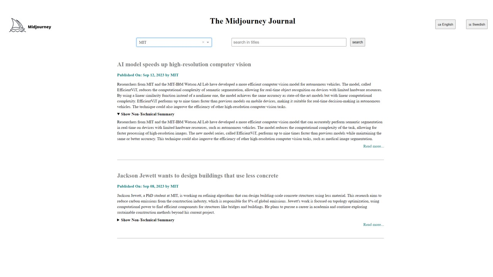

# Project description:
Create a simple dashboard displaying technical and non-technical summaries from a number of AI blogs. It should be possible to choose language (english/swedish) as well as easily see the full article. 
  
The following steps were included in the project: ELT of blog articles, summarize (CHatGPT and local model), translate (ChatGPT or local model) and present in dashboard. Dockerize and use Airflow for scheduling pipline.
  

# Snapshot of the dashboard:

